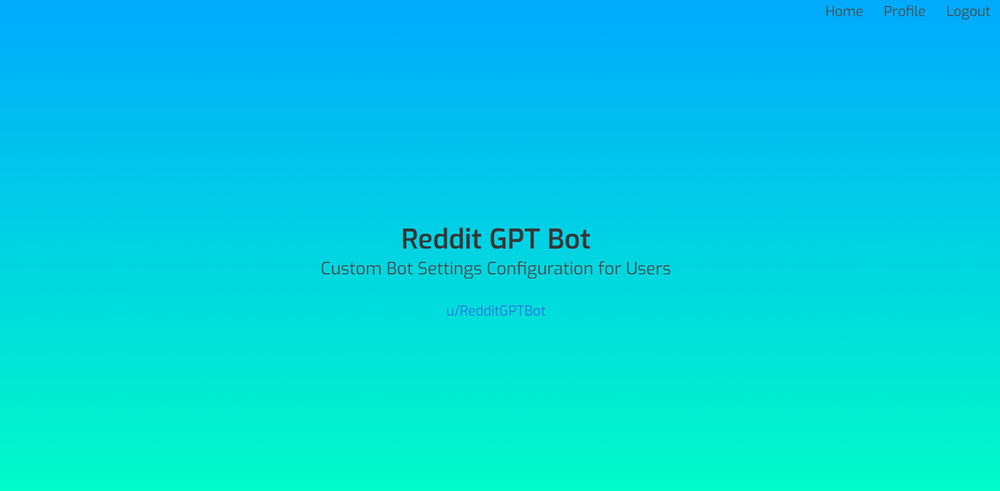
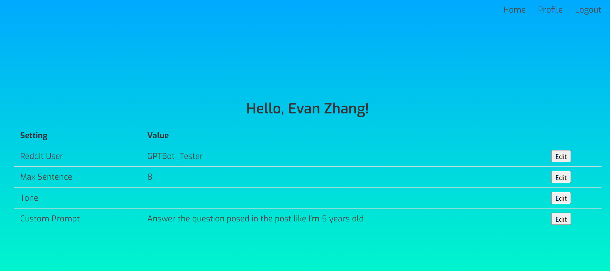
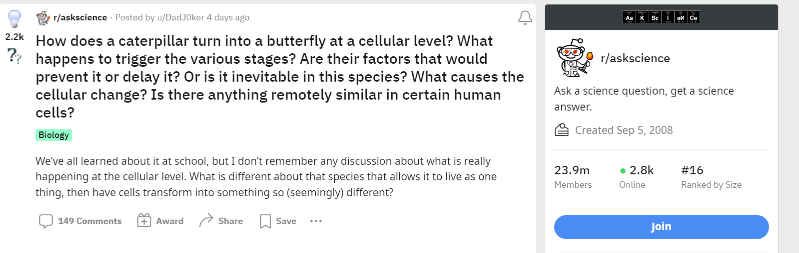
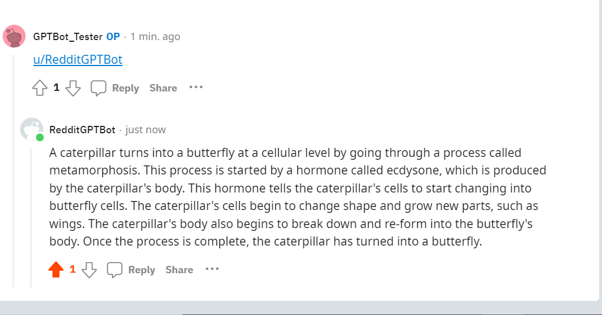

# Reddit GPT Bot

Reddit GPT Bot is a Python-based bot that uses OpenAI's GPT model to summarize and answer Reddit posts. This bot allows users to customize their personal bot settings and provides tailored responses based on their preferences.

## Installation

To install and set up the Reddit GPT Bot project locally, follow these steps:

1. Clone the project repository from GitHub:

git clone https://github.com/your-username/reddit-gpt-bot.git

2. Set up the necessary environment variables:
- OpenAI API Key: Obtain an API key from OpenAI and set it as an environment variable.
- Reddit API Key: Create a Reddit bot and obtain the API credentials. Set the client ID, client secret, user agent, username, and password as environment variables.

3. Install the required dependencies:

pip install -r requirements.txt

## Usage

The Reddit GPT Bot project allows you to interact with the bot and customize your settings. Follow these steps to use the bot:

1. Set up your personal bot settings:
- Access the webserver provided by the project.

- Register an account and log in.
- Navigate to the profile settings page and enter your Reddit username, preferred number of sentences, tone, and any custom prompt.

2. Interacting with the bot on Reddit:
- Choose a post where you need a explanation/summary

- To tag the bot in a Reddit post, use the username "u/RedditGPTBot".
- After tagging, you can include a custom prompt in your comment to guide the bot's response.
- The bot will respond based on your personalized settings and provide a summary or answer related to the post.

## Features

- Summarizing Reddit posts: The bot uses OpenAI's GPT model to generate concise summaries of Reddit posts.
- Personalized bot settings: Users can customize their bot settings, such as the number of sentences, tone, and custom prompt.
- Web interface for configuration: The project provides a webserver with login and registration functionality to manage user profiles and settings.
- Seamless Reddit integration: Simply tag "u/RedditGPTBot" in a Reddit post to engage with the bot and receive tailored responses.

## Technologies Used

- Flask: A micro web framework for building the webserver and handling user authentication.
- PRAW: A Python wrapper for the Reddit API, used to interact with Reddit and fetch posts and comments.
- OpenAI GPT: The GPT model from OpenAI, used for generating summaries and answers.
- HTML and CSS: Used for creating the web interface and styling the pages.
- Python: The primary programming language used for the project.

## Dependencies

The following dependencies are required to run the Reddit GPT Bot project:

- Flask
- Flask-SQLAlchemy
- Flask-Login
- Werkzeug
- Pandas
- PRAW
- OpenAI
